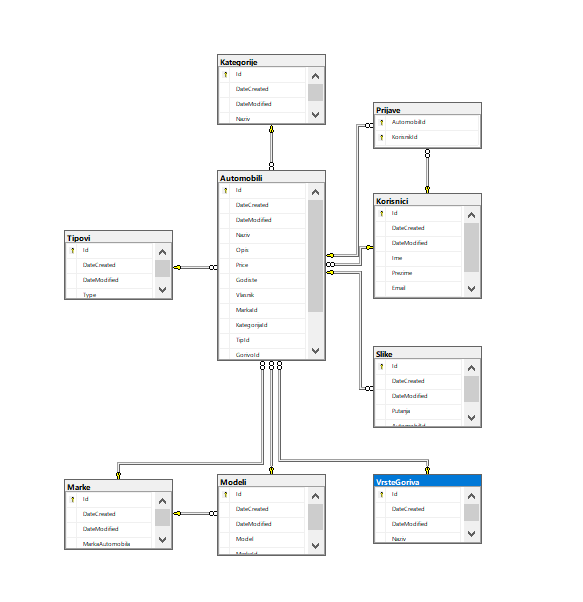

# Oglasi

## Tema projekta

Projekat je osmisljen da bude oglasavanje vozila za prodaju, npr. kao sto je sajt ( polovniautomobili.com ). Moze da se oglasi bilo koja vrsta vozila.

## Funkcionalnost

* Za postavljanje novog oglasa, potrebni su sledeci koraci :

[x] Izabrati Marku
[x] Model
[x] Kategoriju
[x] Tip 
[x] Postaviti naslov oglasa
[x] Postaviti opis oglasa
[] Postaviti sliku za oglas

> Za svaki od prethodnih koraka, postoji i :

- API sloj, preko swaggera, za testiranje komandi.
- WEB, crud za upravljanje oglasom i korisnikom.

* Korisnik takodje moze i da se prijavi na odredjeni oglas, tkz. pracenje oglasa.

## Dizajn baze podataka

